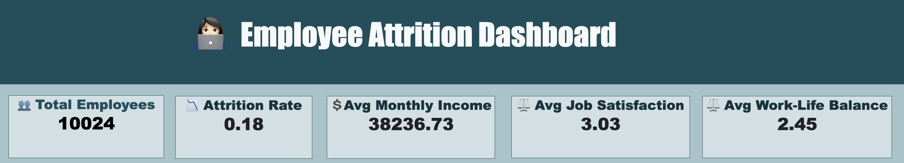
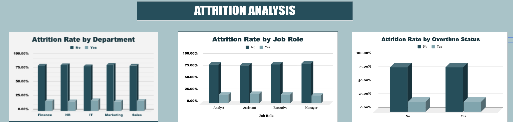
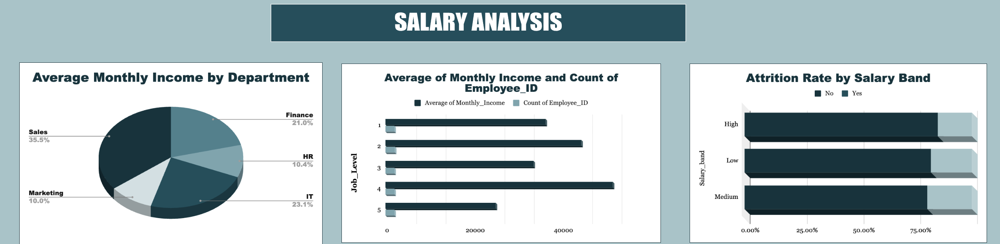
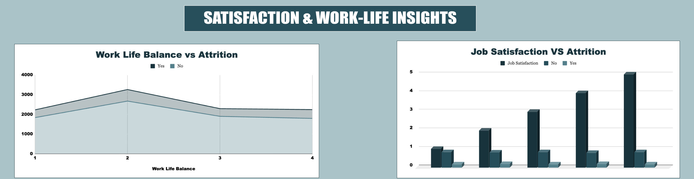
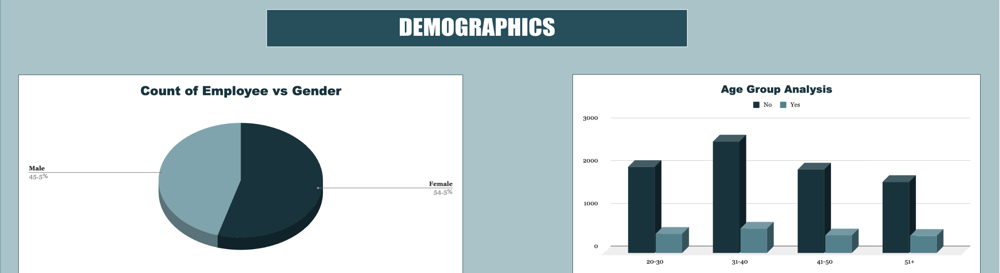
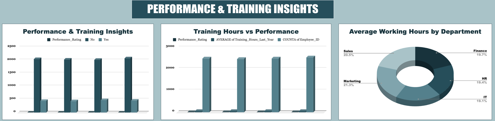

# Employee Attrition Analytics & Workforce Insights

## 📌 Project Overview
Employee attrition directly impacts organizational cost, productivity, and team stability.  
This project performs an **industry-style HR analytics study** using structured employee data to uncover:

✔ Attrition drivers  
✔ Compensation patterns  
✔ Workforce risk segments  
✔ Actionable retention strategies  

**Project Objective:**  
To analyze employee data and generate decision-ready insights that help HR leaders reduce attrition risk.

---

## 🗂 Dataset Details

**Source:** Kaggle – Employee Attrition Prediction Dataset  
**Type:** Simulated HR Dataset  
**Records:** 10,024 Employees  
**Target Variable:** `Attrition (Yes/No)`

**Dataset Characteristics:**
- Demographic attributes
- Job & compensation metrics
- Satisfaction & engagement indicators
- Performance & training variables

---

## 📷 Dataset Analysis Screenshots

### 🔹 KPI Summary

### 🔹 ATTRITION ANALYSIS

### 🔹 SALARY ANALYSIS

### 🔹 SATISFACTION & WORK-LIFE INSIGHTS

### 🔹 DEMOGRAPHICS

### 🔹 PERFORMANCE & TRAINING INSIGHTS

---

## 📁 Repository Structure

| File / Folder | Description |
|--------------|-------------|
| `raw_dataset` | Raw datasets |
| `cleaned_dataset` | Cleaned datasets |
| `calculation_and_pivotTable` | KPI calculations & pivot tables |
| `dashboard` | Interactive dashboard files |
| `presentation` | Capstone PPT |
| `documentation` | Capstone Report |
| `img` | Dashboard visuals |
| `README.md` | Project documentation |

---

## 📖 Data Dictionary (Key Variables)

| Column | Description |
|--------|-------------|
| Employee_ID | Unique identifier |
| Age | Employee age |
| Gender | Male / Female |
| Department | Functional area |
| Job_Role | Employee position |
| Job_Level | Hierarchy level |
| Monthly_Income | Salary |
| Job_Satisfaction | Satisfaction rating (1–5) |
| Work_Life_Balance | WLB rating |
| Overtime | Yes / No |
| Performance_Rating | Performance score |
| Attrition | Exit indicator |

---

## 📊 Key Insights & Statistics

### 🎯 Workforce KPIs
✔ **Total Employees:** 10,024  
✔ **Attrition Rate:** 18.15%  
✔ **Avg Monthly Income:** ₹38,236  
✔ **Avg Job Satisfaction:** 3.03 / 5  

---

### 🔥 Attrition Insights
- **IT Department** exhibits highest attrition  
- **Assistant Roles** show elevated turnover  
- Overtime impact relatively minimal  
- Lower work-life balance linked with higher exits  

---

### 💰 Compensation Insights
- Significant salary disparity across departments  
- Salary progression anomalies across Job Levels  
- **High Salary Band → Lowest Attrition**

---

### 😊 Employee Experience Insights
- Work-Life Balance stronger predictor than satisfaction  
- Manager relationship impact limited  

---

## 🧹 Data Cleaning Notes

✔ Standardized categorical variables (Yes/No inconsistencies)  
✔ Validated rating scales  
✔ Checked missing/null values  
✔ Verified numeric ranges  

---

## 📈 Dashboard Summary

The interactive dashboard enables:

✔ KPI Monitoring  
✔ Department-wise Attrition Tracking  
✔ Job Role Risk Identification  
✔ Salary & Compensation Analysis  
✔ Satisfaction & Engagement Insights  
✔ Performance & Training Review  
✔ Distance-from-Home Impact  

**Features:**  
Dynamic filters / slicers for drill-down analysis.

---

## 🔮 Forecasting / Future Enhancements

Potential extensions include:

- Predictive attrition modeling (ML / Logistic Regression)
- Attrition risk scoring system
- Time-series attrition forecasting
- Feature importance analysis

---

## 💡 Analysis Suggestions

Future analytical improvements:

• Machine Learning classification models  
• Cohort & survival analysis  
• Employee retention simulations  
• Exit prediction scoring  

---

## 🌐 Project Dashboard / Live View

👉 **Dashboard Link:**  
https://docs.google.com/spreadsheets/d/11k6a7roDlZMBnM63qBJszrIvSV6clFQgL7Gq24U1zqo

---

## ✅ Business Recommendations

✔ Target retention strategies in high-attrition departments  
✔ Correct compensation structure inconsistencies  
✔ Improve work-life balance initiatives  
✔ Strengthen engagement for junior roles  
✔ Consider commute-support policies  

---

## ⚠️ Limitations

• Dataset is simulated  
• No historical/time dimension  
• External organizational factors excluded  

---

## 🚀 Author / Team

**Project:** Capstone 1 
**Prepared By:** SectionB Group-12 
**Mentor:** Satyaki Das

---

## ⭐ Final Note
This project demonstrates how **HR analytics transforms workforce data into strategic, decision-ready insights**.
